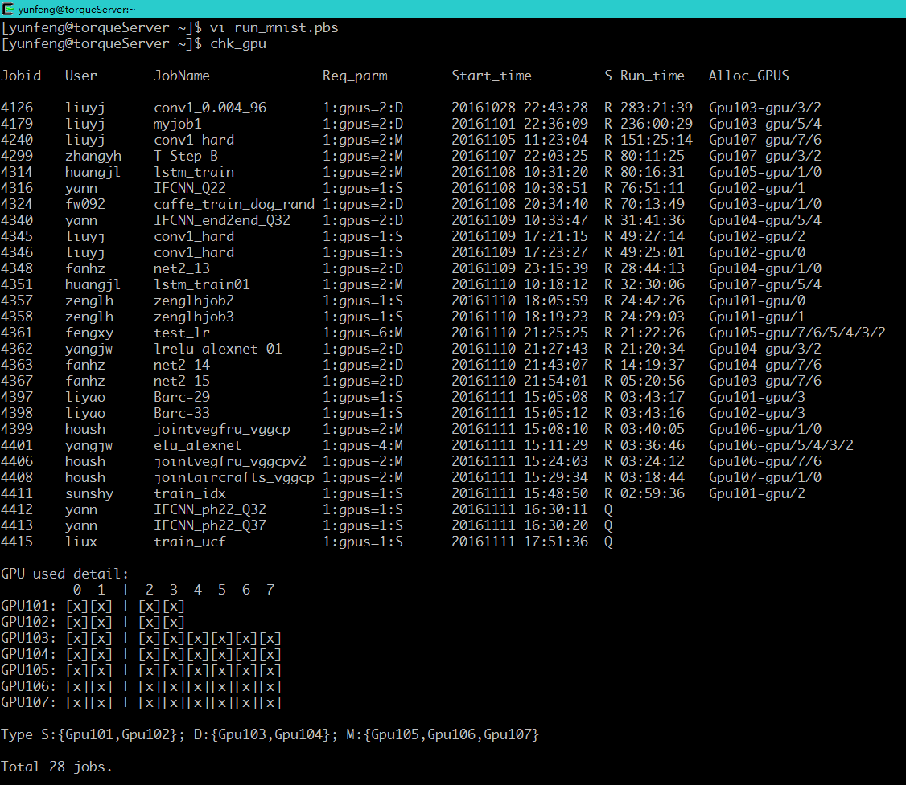

<!-- page_number: true -->
<!-- $theme: default -->
GPU Cluster Usage Tutorial
==
 *--How to make caffe and enjoy tensorflow on Torque*

Yunfeng Wang
wangyf11@mail.ustc.edu.cn

---

PBS and Torque
==
- PBS: **P**ortable **B**atch **S**ystem, computer software that performs job scheduling
- versions of PBS
  1. OpenPBS: original open source version
  2. Torque: A fork of OpenPBS
  3. PBS Pro: the commercial version of PBS
- Torque: **T**erascale **O**pen-source **R**esource and **Q**U**E**ue Manager, a distributed resource manager providing control over batch jobs and distributed compute nodes
- All commands of Torque are compatible with PBS 

---

Basic info about cluster
==
- TorqueServer: 192.168.17.240, 8 cores
- GPU cluster: 192.168.6.[101-107], aliased as Gpu101-Gpu107, 32 cores each node
- Shared data disks and home dir

----

```shell
[yunfeng@torqueServer ~]$ lsb_release -a # Check distro info
LSB Version:    :core-4.0-amd64:core-4.0-noarch:graphics-4.0-amd64:graphics-4.0-noarch:printing-4.0-amd64:printing-4.0-noarch
Distributor ID: CentOS
Description:    CentOS release 6.3 (Final)
Release:        6.3
Codename:       Final
[yunfeng@torqueServer ~]$ cat /proc/cpuinfo #Get num of CPU
```

---

Workflow of run job in Torque
==
- First login to torqueserver, then debug on Gpu107
- Since everything is OK, write the script and send your task to queue
- Wait
- Check your results and errors

---

Login to cluster
==
Register an account
You need a ssh client, which has been included in XShell, cgywin and Linux.
```shell
$MY-PC ssh yunfeng@192.168.17.240
Last login: Fri Nov 11 10:38:16 2016 from 192.168.102.198
[yunfeng@torqueServer ~]$ df -h
Filesystem            Size  Used Avail Use% Mounted on
/dev/sdb1             985G  393G  543G  42% /home
/dev/sdc1             1.8T  865G  868G  50% /data
/dev/sdd1             8.1T  7.3T  415G  95% /data0
192.168.6.103:/data3  1.4T  679G  718G  49% /data3
192.168.6.104:/data4  1.4T  1.1T  314G  78% /data4
192.168.6.105:/data5  1.4T  552G  845G  40% /data5
192.168.6.106:/data6  1.4T  1.3T  102G  93% /data6
192.168.6.107:/data7  1.4T  1.4T   13G 100% /data7
192.168.6.101:/data1  1.3T  770G  561G  58% /data1
192.168.6.102:/data2  1.3T  447G  883G  34% /data2
```

---

tips: SSH without  password
==

```shell
$ ssh-keygen #Simply type enter all the way down
$ ssh-copy-id -i yunfeng@192.168.17.240 # Enter password
$ ssh yunfeng@192.168.17.240 #No password needed since now!

```

---

tips: Use aliases to speed up workflow
==
```shell
$ echo "alias ssh240='ssh yunfeng@192.168.17.240'" >> ~/.bashrc
$ source ~/.bashrc
$ ssh240 # Same as 'ssh yunfeng@192.168.17.240'
```

---

tips: Some utilities to improve your shell experience
==
1. [oh-my-zsh](https://github.com/robbyrussell/oh-my-zsh)
2. tmux
3. ipython

---

Login to Gpu107 to debug your Caffe
==
```shell
[yunfeng@torqueServer ~]$ ssh Gpu107
Last login: Fri Nov 11 11:02:43 2016 from torqueserver
[yunfeng@Gpu107 ~]$ nvidia-smi
```
 
---

```shell
|===============================+======================+======================|
|   0  Tesla K80           Off  | 0000:04:00.0     Off |                    0 |
| N/A   26C    P8    26W / 149W |     22MiB / 11519MiB |      0%      Default |
+-------------------------------+----------------------+----------------------+
|   1  Tesla K80           Off  | 0000:05:00.0     Off |                    0 |
| N/A   23C    P8    29W / 149W |     22MiB / 11519MiB |      0%      Default |
+-------------------------------+----------------------+----------------------+
|   2  Tesla K80           Off  | 0000:84:00.0     Off |                    0 |
| N/A   48C    P0    98W / 149W |   9106MiB / 11519MiB |     99%      Default |
+-------------------------------+----------------------+----------------------+
|   3  Tesla K80           Off  | 0000:85:00.0     Off |                    0 |
| N/A   24C    P8    30W / 149W |     22MiB / 11519MiB |      0%      Default |
+-------------------------------+----------------------+----------------------+
|   4  Tesla K80           Off  | 0000:8A:00.0     Off |                    0 |
| N/A   34C    P0    60W / 149W |   2181MiB / 11519MiB |      0%      Default |
+-------------------------------+----------------------+----------------------+
|   5  Tesla K80           Off  | 0000:8B:00.0     Off |                    0 |
| N/A   47C    P0   153W / 149W |   8349MiB / 11519MiB |     98%      Default |
+-------------------------------+----------------------+----------------------+
|   6  Tesla K80           Off  | 0000:8E:00.0     Off |                    0 |
| N/A   40C    P0    96W / 149W |   4404MiB / 11519MiB |     91%      Default |
+-------------------------------+----------------------+----------------------+
|   7  Tesla K80           Off  | 0000:8F:00.0     Off |                    0 |
| N/A   58C    P0   147W / 149W |   5361MiB / 11519MiB |     95%      Default |
+-------------------------------+----------------------+----------------------+
```

---

1. Copy compiled caffe to your dir
```shell
[yunfeng@Gpu107 ~]$ mkdir /data2/yunfeng
[yunfeng@Gpu107 ~]$ cd /data2/yunfeng
[yunfeng@Gpu107 ~]$ cp -r /opt/caffe-master .
[yunfeng@Gpu107 ~]$ mv caffe-master caffe
```
2. Write shell script to run your job
```shell
# /home/yunfeng/run_mnist.sh Example script of running mnist
cd /data3/yunfeng/caffe
./data/mnist/get_mnist.sh
./examples/mnist/create_mnist.sh
./examples/mnist/train_lenet.sh


```

3. Debug and check everything is OK
```shell
[yunfeng@Gpu107 ~]$ cd ~
[yunfeng@Gpu107 ~]$ chmod +x run_mnist.sh
[yunfeng@Gpu107 ~]$ ./run_mnist.sh
```

---

Cluster types
==
```shell
GPU used detail:
         0  1  |  2  3  4  5  6  7
GPU101: [x][x] | [x][x]
GPU102: [x][x] | [x][x]
GPU103: [x][x] | [x][x][x][x][x][x]
GPU104: [x][x] | [x][x][x][x][x][x]
GPU105: [x][x] | [x][x][x][x][x][x]
GPU106: [x][x] | [x][x][x][x][x][x]
GPU107: [x][x] | [x][x][x][x][x][x]

Type S:{Gpu101,Gpu102};D:{Gpu103,Gpu104};M:{Gpu105,Gpu106,Gpu107}
```

---

Submit your job to queue
==
1. go to head node, write pbs script
```shell
 # /home/yunfeng/run_mnist.pbs configuration file of your job
 #PBS -N run_mnist  #Name of your job
 #PBS -o /home/yunfeng/run_mnist.out #the file stdout will write to
 #PBS -e /home/yunfeng/run_mnist.err #the file stderr will write to
 #PBS -l nodes=1:gpus=1:S #cluster type to use
 #PBS -r y #run the job immediately or not
 
 ## Put out debug info,don't modify this part
 cd $PBS_O_WORKDIR
 echo Time is `date`
 echo Directory is $PWD
 echo This job runs on following nodes:
 cat $PBS_NODEFILE
 
 ## The name of script to run main job
 ./run_mnist.sh
```

---

2. Submit job and check status
```shell
[yunfeng@torqueServer ~]$ qsub run_mnist.pbs # Send job to queue
[yunfeng@torqueServer ~]$ chk_gpu # Check the status of your job
```
---


--- 

Other useful pbs commands
==
```shell
[yunfeng@torqueServer ~]$ qstat # Show status of pbs jobs
[yunfeng@torqueServer ~]$ qhold job_id # Hold pbs jobs
[yunfeng@torqueServer ~]$ qrls job_id #Release hold of jobs
[yunfeng@torqueServer ~]$ qel job_id # Delete job
[yunfeng@torqueServer ~]$ pbsnodes # Show staus of nodes
```

---

How to run Tensorflow on Cluster?
==
1. Use system tensorflow (version:0.10.0)
```shell
[yunfeng@Gpu107 ~]$ ipython
Python 2.7.5 (default, Nov 20 2015, 02:00:19)
Type "copyright", "credits" or "license" for more information

In [1]: import tensorflow as tf

In [2]: tf.__version__
Out[2]: '0.10.0'
```
2. Or [install lastest version](https://github.com/tensorflow/tensorflow) of tensorflow for yourself
```shell
$ export TF_BINARY_URL=https://storage.googleapis.com/tensorflow/linux/gpu/tensorflow-0.11.0rc2-cp27-none-linux_x86_64.whl
$ pip install --user --upgrade $TF_BINARY_URL
```
3. Write your command in shell script and then submit it, just like the example above

---

How to prepare data for my experiment?
==
1. Use `scp` to copy your data to cluster
```shell
$ scp -r my_data/ yunfeng@192.168.17.240:/data3/yunfeng/
```
2. Since data disks are shared, you can then use  your data in code
```python
# example.py
data_dir = '/data3/yunfeng/my_data'
result = my_func(data_dir)
```

---

How to check logs of my job 
==
Normally, we can only see log when job finished. However,we can 
1. Use `>>` or `tee` to 
```shell
# run_mnist.sh
...
./examples/mnist/train_lenet.sh >> my_mnist_log
```
```shell
# run_mnist.sh
...
#Please check the manual of tee to fully use it.
./examples/mnist/train_lenet.sh | tee my_mnist_log
```
2. Use tensorflows' tensorboard to check the result
```shell
$ tensorboard --logdir=path/to/log-directory
```

---

Docs location
==
<https://github.com/vra/docs-and-slides>

---

Q&A
==
